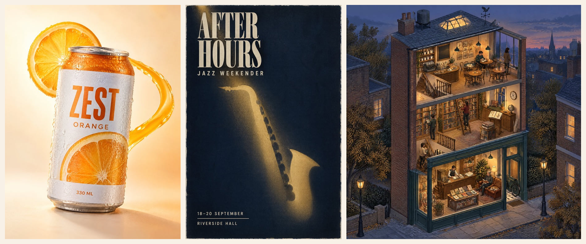
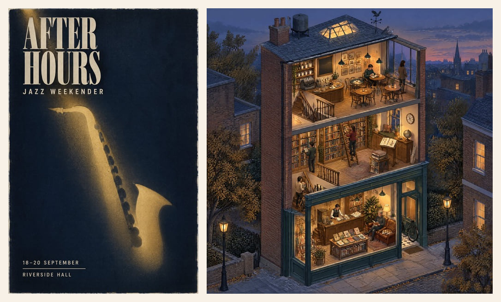

<div align="center">



# Callirra ✦ One key, every model

**Callirra is not another AI generator.** It is one product for image and video generation: the leading models, a public prompt atlas, unified credit billing, an OpenAI-compatible API, content safety and the payment, tax and subscription paperwork already handled. Creators go from one sentence to a finished frame in the browser; developers get image *and* video behind a single `sk-cal-` key instead of stitching together five vendors, a billing system and a merchant entity.

<a href="https://github.com/callirra-ai/gpt-image-2-5-prompt-atlas"></a>
<a href="https://github.com/callirra-ai/gpt-image-2-5-prompt-atlas"></a>
<a href="https://www.npmjs.com/package/@callirra/cli"></a>
<a href="https://www.npmjs.com/package/@callirra/mcp"></a>


<sub><b><a href="https://callirra.com?utm_source=github-org">Website</a></b> · <a href="#what-we-ship-here">What we ship here</a> · <a href="#models-you-can-access">Models</a> · <a href="#pricing-at-a-glance">Pricing</a> · <a href="#connect">Contact</a></sub>

</div>

---

## What we ship here

### [GPT Image 2.5 Prompt Atlas](https://github.com/callirra-ai/gpt-image-2-5-prompt-atlas) — 50 prompts, 50 frames, one measured comparison

Every prompt shipped with the exact frame it produced: **20 short showcase prompts** (5–500 words) and **30 full engineering briefs** (400–4,500 words that pin down canvas, light, materials, exact text and object counts), plus a measured **Flare vs Sunburst** tier comparison. Every entry deep-links into the generator with the form pre-filled. CC BY 4.0.

### OpenAI-compatible media API

One key for image **and** video generation:

```text
GET  https://api.callirra.com/v1/models
POST https://api.callirra.com/v1/images/generations
POST https://api.callirra.com/v1/videos
```

Also public: `GET /api/v1/creative` — the creative knowledge base (below) as JSON.

### CLI · MCP server · Agent skill

Bring the same catalogue to where you already work:

- **[`@callirra/cli`](https://github.com/callirra-ai/cli)** — terminal generation, prompt templates, balance and task management
- **[`@callirra/mcp`](https://github.com/callirra-ai/mcp)** — MCP server for Claude Code, Cursor, Codex and other agents
- **[`skill`](https://github.com/callirra-ai/skill)** — an installable agent skill with the creative knowledge base and workflows

### The public creative knowledge base

| | |
|---|---|
| **8** categories | models · open source · prompts · design · assets · cinematography · styles · community |
| **110** curated resources | every entry with a URL, a one-line description and tags |
| **39** style keywords | from cyberpunk and Bauhaus to Kodachrome and volumetric light |
| **61** craft terms | lighting (15) · camera (19) · composition (14) · colour (13) |



### Billing that is already solved

Credits, credit packs, auto-renewing subscriptions (monthly / quarterly / yearly), refunds, taxes and PCI compliance are handled by **Waffo Pancake** as merchant of record — including the automatic-renewal disclosures and reminder emails. Subscriptions are issued credits **monthly** and can be cancelled or resumed at any time from the billing page.

## Models you can access

**Image** — GPT Image 2.5 (Flare & Sunburst) · GPT Image 2 · Nano Banana 2 · Seedream 5 · Flux 1.1 Pro · Grok Imagine Image 2 · Wan 2.7 Image · Z-Image

**Video** — Seedance 2.5 · Seedance 2.0 · Kling 3.0 · Veo 3.1 · Sora 2 Pro · MiniMax H3 · Hailuo 2.3 · HappyHorse 1.0 · Grok Imagine Video 1.5 · Gemini Omni Video · Wan 2.5

Live catalogue and per-model credit costs: [callirra.com/pricing](https://callirra.com/pricing?utm_source=github-org) · [image generator](https://callirra.com/ai-image-generator?utm_source=github-org) · [video generator](https://callirra.com/ai-video-generator?utm_source=github-org)

## Pricing at a glance

- **Free** — 15 credits every week, reset weekly, no carryover
- **Credit packs** — one-time top-ups, valid 1 year, unlock after your first subscription
- **Subscriptions** — monthly / quarterly / yearly, **renew automatically** until you cancel; credits are issued monthly, and cancelling keeps your access until the end of the paid period
- **Launch offer** — 20% off the first month of a monthly subscription (one-time, first purchase)
- **Refunds** — 7-day window on unused credits
- **Taxes** — calculated and collected at checkout by the merchant of record

## Connect

- 🌐 [callirra.com](https://callirra.com?utm_source=github-org)
- 🐦 [X / Twitter — @Callirra](https://x.com/Callirra)
- ✉️ support@callirra.com
- 📚 [API docs](https://callirra.com/api?utm_source=github-org) · [pricing](https://callirra.com/pricing?utm_source=github-org) · [showcase](https://callirra.com/showcases?utm_source=github-org)
- ⚖️ [Terms](https://callirra.com/terms-of-service?utm_source=github-org) · [Privacy](https://callirra.com/privacy-policy?utm_source=github-org) · [Refunds](https://callirra.com/refund-policy?utm_source=github-org)

<sub>Callirra is an independent platform. Model names and trademarks belong to their respective owners.</sub>
